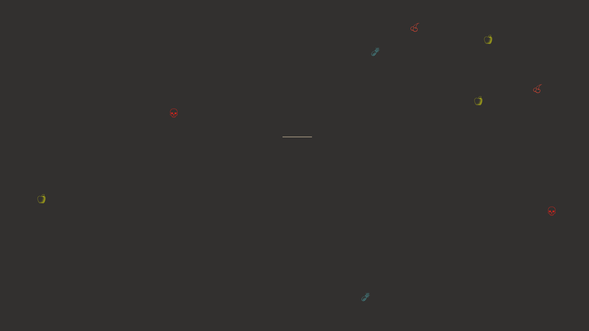

# Snake

Small snake game for the terminal, built with Rust and the [Termion][1] library.



# Installation

1. [Install Rust (and Cargo)][2]
2. Clone this repository
3. Run `cargo run --release` inside the folder

# Drops

* Growth (🍏): length increases by one.
* Death (💀): game ends.
* Speed (🍒): game speed increases.
* Slow (🍍) : game speed decreases.

# Notes

**Asynchronous Event Handling**

`Termion` comes with an `AsyncReader` struct that can be used for non-blocking I/O. Normally, with blocking I/O,
you'd write something like this:

```rust
let stdin = std::io::stdin();
for event in stdin.keys() {
  // Handle event
}
```

With the asynchronous version, it looks like this instead:

```rust
let stdin = termion::async_stdin();
let keys = stdin.keys();

loop {
    let possible = keys.next();

    if let Some(event) = possible {
      // Handle event
    } else {
      // Do other things
    }
}
```

An issue arises when the queue fills up faster than we can drain it. For this game, I only care about the latest
user input--otherwise the user might get confused when their inputs from several seconds ago are executed. Currently
I manually drain the queue when I find an event:

```rust
if let Some(mut event) = possible {

    // Drain event queue completely if there's more than one event
    while let Some(next) = keys.next() { event = next; }
}
```

I'm not sure if there's a better way to do it, but this ensures I only poll the latest event.

**Diff Rendering**

I started off by clearing and redrawing the whole game at each frame, but it was a little slow.
So now I'm only drawing exactly the tiles that need to be updated: the gameplay is smoother, but the
drawing code and game logic are a lot more tightly coupled.

Possible solutions:

- Return which tiles need to be updated after each step?
- Maintain more information in snake state, e.g. previous tail tile?

# Future Extensions

This was mostly done in a few hours as a proof of concept, to familiarize myself with some library features.
I don't expect to revisit this code anytime soon, but maybe one day it would be neat to implement:

- Proper win and loss messages
- More drops
- Leaderboard
- Customizable terrain

[1]: https://github.com/redox-os/termion
[2]: https://rustup.rs/
